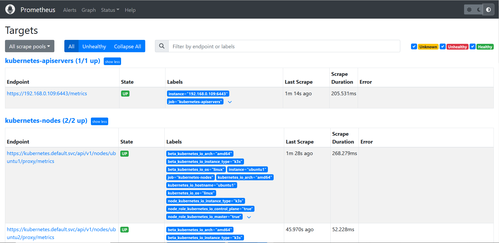

# Ansible Role: prometheus_k3s

Installs and configures docker and docker_compose on Debian/Ubuntu servers.

## Requirements

No special requirements; note that this role requires root access, so either run it in a playbook with a global `become: yes`, or invoke the role in your playbook like:

```yaml
- hosts: k3s_cluster
  become: true
  roles:
    - prometheus_k3s
```

Specify root or any other user with sudo privileges as the remote user.
There are two ways you can do this:

### 1. ansible.cfg file

```ini
[defaults]
inventory = hosts.yml
private_key_file = ~/.ssh/cluster
stdout_callback = yaml
stderr_callback = yaml
remote_user = root
```

### 2. hosts file

```yaml
k3s_masters:
  hosts:
    master1:
      ansible_host: 192.168.0.109
k3s_workers:
  hosts:
    worker1:
      ansible_host: 192.168.0.110
k3s_cluster:
  children:
    k3s_masters:
    k3s_workers:
```

## Role Variables

Available variables are listed below, along with default values (see `defaults/main.yml`):

If you want to install helm, set the `helm_install` variable to true and specify the version in the `helm_version` variable.

```yaml
# Installation
helm_install: false
helm_version: 'v3.12.3'
```

If you want to add repo, set the `helm_repo_add` variable to true and specify the options in the `helm_repo_options` variable.

```yaml
helm_repo_add: false
helm_repo_options: []
# - name: 'repo_name'
#   uri: 'repo_url'
```

If you want to remove repo or delete helm charts, set the `helm_repo_remove` and `helm_delete_charts` variables to true.

```yaml
helm_repo_remove: true
helm_delete_charts: true
```

Default project-path settings. 
Copy the entire project into the files directory of the ansible role and specify the path to the project directory.
Or specify the relative path to your k3s project

```yaml
k3s_remote_dir: /opt/prometheus_project/ # Project files destination
k3s_local_dir: prometheus_project/ # role-directory/files/prometheus_project
```

The value of the `k3s_state` variable controls the state of `k3s`.

```yaml
# Containers state.
k3s_state: 'install'
# install - install k3s
# deploy - deploy files
# install-deploy - install k3s and deploy files
# delete - delete all resources
# uninstall - uninstall k3s
# delete-uninstall - delete all resources and uninstall k3s
```

## Example Playbook

```yaml
---
- hosts: k3s_cluster
  become: true
  roles:
    - prometheus_k3s
```

*Inside `vars/main.yml`*:

```yaml
helm_install: false
helm_version: 'v3.12.3'
helm_repo_add: false
helm_repo_remove: true
helm_delete_charts: true
helm_repo_options:
  - name: 'ingress-nginx'
    uri: 'https://kubernetes.github.io/ingress-nginx'
  - name: 'portainer'
    uri: 'https://portainer.github.io/k8s/'
  - name: 'prometheus-community'
    uri: 'https://prometheus-community.github.io/helm-charts'
  - name: 'grafana'
    uri: 'https://grafana.github.io/helm-charts'
  - name: 'tricksterproxy'
    uri: 'https://helm.tricksterproxy.io'

k3s_state: 'delete-uninstall'
k3s_remote_dir: /opt/prometheus_project/
k3s_local_dir:  prometheus_project/

deploy_command: |
  mkdir /data/ -p
  chmod 777 -R /data/
  mkdir -p /data/volumes/portainer
  chmod 777 /data/volumes/portainer
  helm upgrade --install ingress-nginx -f {{ k3s_remote_dir }}ingress-nginx-values.yaml {{ k3s_remote_dir }}ingress-nginx/ 
  helm upgrade --install --create-namespace prometheus -f {{ k3s_remote_dir }}prometheus-values.yaml {{ k3s_remote_dir }}prometheus/ -n monitoring
  helm upgrade --install --create-namespace grafana -f {{ k3s_remote_dir }}grafana-values.yaml {{ k3s_remote_dir }}grafana/ -n monitoring
  helm upgrade --install --create-namespace trickster -f {{ k3s_remote_dir }}trickster-values.yaml {{ k3s_remote_dir }}trickster/ -n monitoring
  kubectl apply - f {{ k3s_remote_dir }}prometheus-ingress.yaml
  kubectl apply - f {{ k3s_remote_dir }}grafana-ingress.yaml
  kubectl apply -f {{ k3s_remote_dir }}portainerpv.yml
  kubectl apply -f {{ k3s_remote_dir }}portainerpvc.yml
  helm upgrade --install --create-namespace portainer -f {{ k3s_remote_dir }}portainer-values.yaml {{ k3s_remote_dir }}portainer/ -n monitoring
  kubectl apply - f {{ k3s_remote_dir }}portainer-ingress.yaml
  kubectl patch svc ingress-nginx-controller -p '{"spec":{"externalTrafficPolicy":"Local"}}'

```

# Preview
## 1. Portainer


## 2. Prometheus

## 3. Grafana


## License

MIT / BSD

## Author Information

This role was created in 2023 by [Nick Bykon](https://github.com/hikimory).
